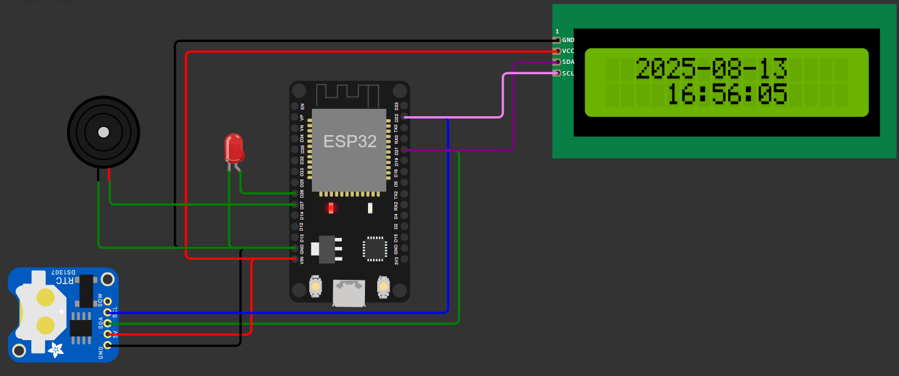

# Automated Office Bell : Interval Notifier (Wokwi Simulation)

Automated Office Bell System using ESP and RTC

** This project simulates and runs an automated office bell system using an ESP microcontroller and a Real-Time Clock (RTC) module, created in the Wokwi simulation environment.

## 🔧 Project Scope

- **Simulation Environment**: [Wokwi](https://wokwi.com)
- **Microcontroller**: ESP32
- **RTC Module**: DS1307
- **Purpose**: Automate office bell ringing at scheduled times (at break times)

## 📌 My Contribution

- Designed and tested the full simulation using Wokwi
- Wrote the embedded C code for ESP32 to communicate with RTC and trigger the bell
- Verified the logic and timing using simulated buzzer
- Provided the codebase and documentation for hardware implementation
> **Note:** Actual hardware development (wiring, soldering, mounting) was completed by another team member.

## 💻 Simulation

- [[Project Link](https://wokwi.com/projects/392309446866052097)]

## 🕒 Features

- Set the bell ringing times via the C code
- Real-time synchronization using DS1307 RTC Module
- Simple digital output to trigger the buzzer
- OLED display showing the time and status

## 📷 Screenshot

